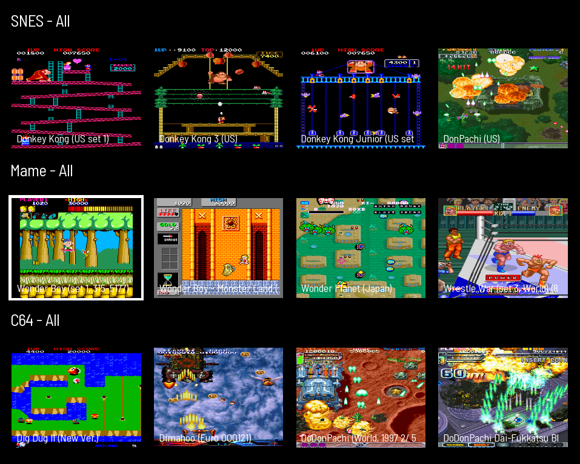
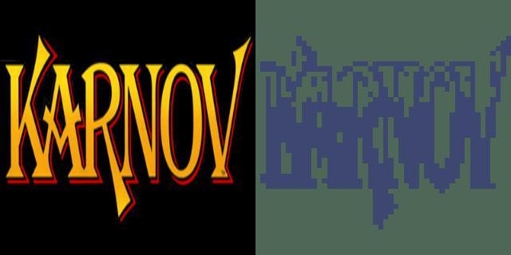
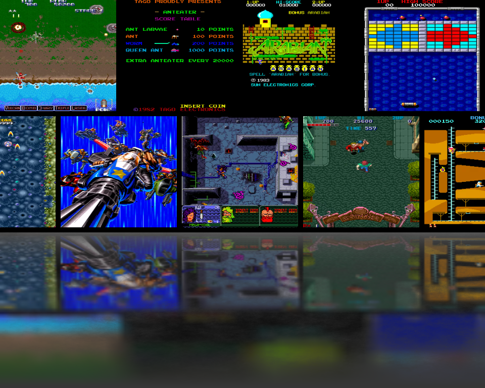
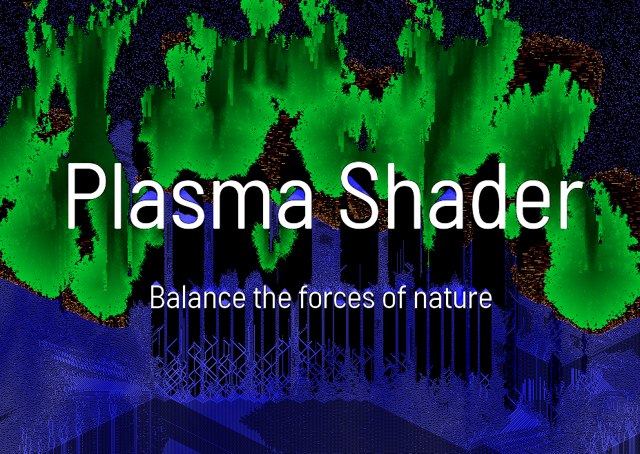

# Attract Mode Experiments

> Attract-Mode Experiments  
> Chadnaut 2025  
> https://github.com/Chadnaut/Attract-Mode-Experiments  

## Disclaimer

These are work-in-progress proof-of-concept experiments. They may be unfinished, non-performant, or broken.

## Experiments

|Screenshot|Description|
|:-|:-|
||[BoxArt](./layouts/Experiment.BoxArt/README.md) - A Shader that adds a conforming reflection to angled boxart images.|
||[DisplayOffset](./layouts/Experiment.DisplayOffset/README.md) - Adds a `display_offset` property which is used to shift assets by display, works like `filter_offset` and `index_offset`.|
||[LCD](./layouts/Experiment.LCD/README.md) - A shader that pixelates and monotones the image to create an LCD effect. Good for some logos, not so good for others.|
||[Reflection](./layouts/Experiment.Reflection/README.md) - A shader that creates a mipmap based blur effect. The actual mirror is simply a clone with a flipped subimg.|
||[RetroZoom](./layouts/Experiment.RetroZoom/README.md) - Scale an image over a non-clearing surface to produce a retro zoom effect.|
||[Sand, Fire, Plasma](./layouts/Experiment.Sand/README.md) - Something different with a surface shader feedback loop.|

## Something Missing?

Sometimes code graduates from an `experiment` to a full-featured `module`, in which case it will be moved from this repo to the main one at:

https://github.com/Chadnaut/Attract-Mode-Modules
