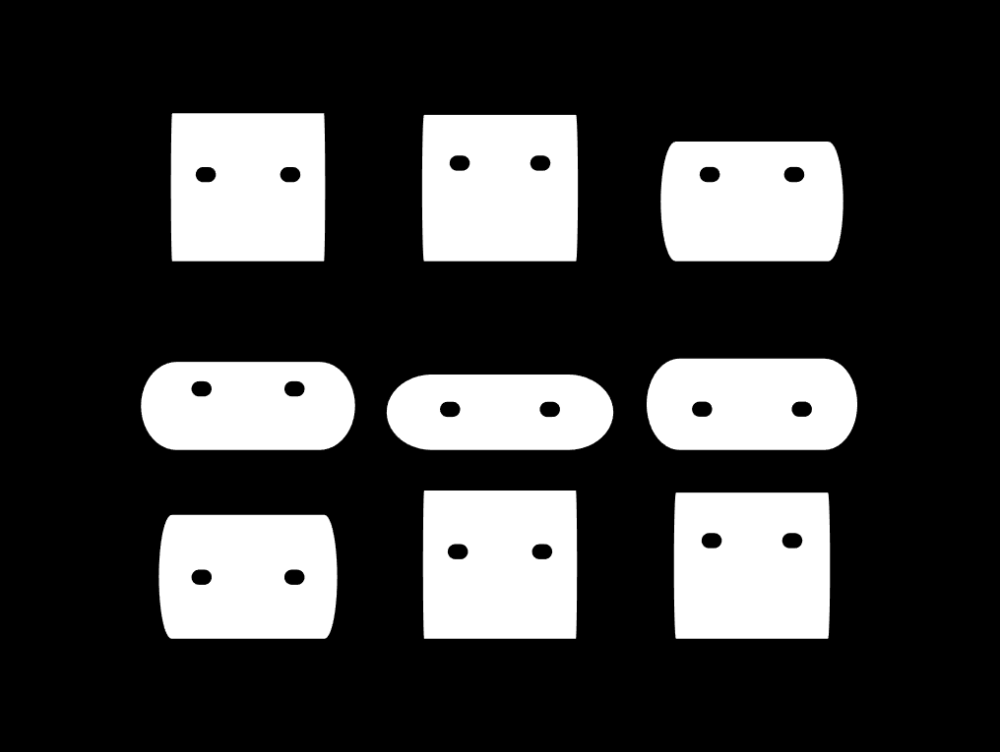

# Attract Mode Experiments

> Attract-Mode Experiments  
> Chadnaut 2025  
> https://github.com/Chadnaut/Attract-Mode-Experiments  
>\
>[][extension]
Get the [*AM+ Squirrel*][extension] extension for VS Code
 A suite of support tools to enhance your AM+ development experience. Code completions, highlighting, linting, formatting, and more!

[extension]: https://marketplace.visualstudio.com/items?itemName=chadnaut.am-squirrel

## Disclaimer

These are work-in-progress proof-of-concept experiments. They may be unfinished, non-performant, or broken.

## Experiments

- *Debug* - Testing or debugging during development.
- *Element* - A new layout element with unique behaviors.
- *Shader* - Adds an effect to an existing layout element.
- *Utility* - Additional functions and classes.

[ArtworkRatio]: ./layouts/Experiment.ArtworkRatio/layout.nut
[Bezel]: ./layouts/Experiment.Bezel/layout.nut
[BoxArt]: ./layouts/Experiment.BoxArt/layout.nut
[BumpMap]: ./layouts/Experiment.BumpMap/layout.nut
[Cathode]: ./layouts/Experiment.Cathode/layout.nut
[Clock]: ./layouts/Experiment.Clock/layout.nut
[CubeMap]: ./layouts/Experiment.CubeMap/layout.nut
[Cylinder]: ./layouts/Experiment.Cylinder/layout.nut
[DisplayOffset]: ./layouts/Experiment.DisplayOffset/README.md
[LCD]: ./layouts/Experiment.LCD/layout.nut
[Mallow]: ./layouts/Experiment.Mallow/layout.nut
[Panorama]: ./layouts/Experiment.Panorama/layout.nut
[Pitcher]: ./layouts/Experiment.Pitcher/layout.nut
[RandomLaunch]: ./plugins/RandomLaunch/plugin.nut
[Reflection]: ./layouts/Experiment.Reflection/layout.nut
[RetroZoom]: ./layouts/Experiment.RetroZoom/layout.nut
[Sand]: ./layouts/Experiment.Sand/README.md
[Segmental]: ./layouts/Experiment.Segmental/layout.nut
[SpinBox]: ./layouts/Experiment.SpinBox/layout.nut
[UltraSweep]: ./layouts/Experiment.UltraSweep/layout.nut

|Preview|Version|Description|Type|Demo|
|-|-|-|-|-|
||`v0.0.1`|[ArtworkRatio] - Match an Artworks aspect ratio.|*Utility*|[Example][ArtworkRatio]
||`v0.0.1`|[Bezel] - Bezel reflection effects.|*Shader*|[Example][Bezel]
||`v0.2.0`|[BoxArt] - A Shader that adds a conforming reflection to angled boxart images.|*Shader*|[Example][BoxArt]
||`v0.0.1`|[BumpMap] - Simple bumpmap effects.|*Shader*|[Example][BumpMap]
||`v0.0.1`|[Cathode] - Cubemap, bezel glow, and screen corners.|*Shader*|[Example][Cathode]
||`v0.0.1`|[Clock] - A realtime animated clock.|*Element*|[Example][Clock]
||`v0.0.1`|[CubeMap] - Cubemap distortion effects.|*Shader*|[Example][CubeMap]
||`v0.0.1`|[Cylinder] - A cylinder effect.|*Shader*|[Example][Cylinder]
||`v0.0.2`|[DisplayOffset] - Adds a `display_offset` property which is used to shift assets by display. *Currently Broken.*|*Utility*|[Example][DisplayOffset]
||`v0.0.1`|[LCD] - A shader that pixelates and monotones the image to create an LCD effect.|*Shader*|[Example][LCD]
||`v0.0.1`|[Mallow] - Happy little marshmallows! *Requires AM+ 3.1.0*|*Utility*|[Example][Mallow]
||`v0.0.1`|[Panorama] - A panoramic screen example.|*Shader*|[Example][Panorama]
||`v0.0.1`|[Pitcher] - Demo showing sound pitch and volume effects. *Requires AM+ 3.1.0*|*Utility*|[Example][Pitcher]
||`v0.0.1`|[RandomLaunch] - Randomly select and launch an unplayed game.|*Plugin*|[Example][RandomLaunch]
||`v0.0.1`|[Reflection] - A shader that creates a mipmap based blur effect.|*Shader*|[Example][Reflection]
||`v0.0.1`|[RetroZoom] - Scale an image over a non-clearing surface to produce a retro zoom effect.|*Utility*|[Example][RetroZoom]
||`v0.0.3`|[Sand] - Something different with a surface shader feedback loop. *Now with Sand, Fire & Plasma!*|*Shader*|[Example][Sand]
||`v0.0.1`|[Segmental] - A Clock made with Rectangle segments.|*Element*|[Example][Segmental]
||`v0.0.1`|[SpinBox] - A fake 3D spinning box.|*Utility*|[Example][SpinBox]
||`v0.0.1`|[UltraSweep] - Zero asset light sweep effect.|*Utility*|[Example][UltraSweep]

## Looking for More?

When code graduates from an experiment to a full-featured module it gets moved to the Modules repo:

- https://github.com/Chadnaut/Attract-Mode-Modules
