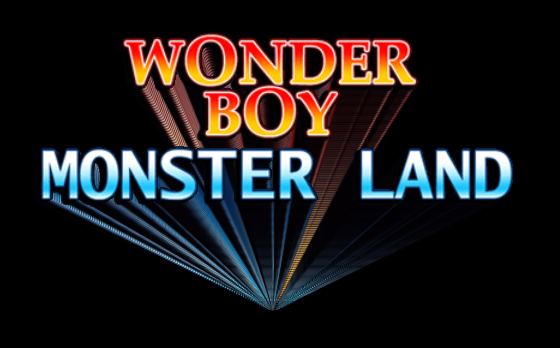

# Attract Mode Experiments

> Attract-Mode Experiments  
> Chadnaut 2024  
> https://github.com/Chadnaut/Attract-Mode-Experiments

## Disclaimer

These are work-in-progress proof-of-concept experiments. They may be unfinished, non-performant, or broken.

## Experiments

|Screenshot|Description|Layout|
|:-|:-|:-|
||[DisplayOffset](./layouts/Experiment.DisplayOffset/README.md) - Adds a `display_offset` property which is used to shift assets by display, works like `filter_offset` and `index_offset`.|[Experiment](./layouts/Experiment.DisplayOffset)|
||[LCD](./layouts/Experiment.LCD/README.md) - A shader that pixelates and monotones the image to create an LCD effect. Good for some logos, not so good for others.|[Experiment](./layouts/Experiment.LCD)|
||[Reflection](./layouts/Experiment.Reflection/README.md) - A shader that creates a mipmap based blur effect. The actual mirror is simply a clone with a flipped subimg.|[Experiment](./layouts/Experiment.Reflection)|
||[RetroZoom](./layouts/Experiment.RetroZoom/README.md) - Scale an image over a non-clearing surface to produce a retro zoom effect.|[Experiment](./layouts/Experiment.RetroZoom)|

## Something Missing?

Sometimes code graduates from an `experiment` to a full-featured `module`, in which case it will be moved from this repo to the main one at:

https://github.com/Chadnaut/Attract-Mode-Modules
