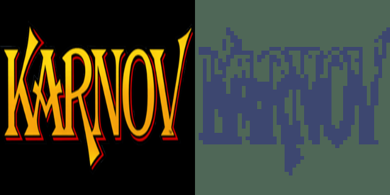

# Experiment LCD

> Chadnaut 2024  
> https://github.com/Chadnaut/Attract-Mode-Experiments

A shader that pixelates and monotones the image to create an LCD effect. Good for some logos, not so good for others.

## Files

- `layout.nut`  The example layout
- `lcd.nut`  The shader
