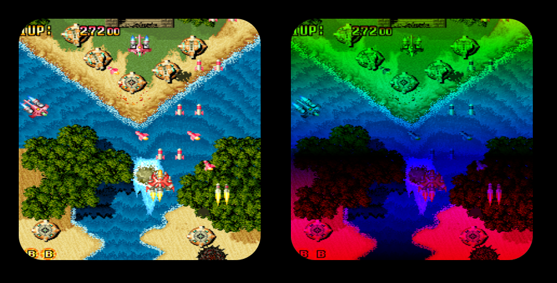

# Experiment Mask

> Chadnaut 2024  
> https://github.com/Chadnaut/Attract-Mode-Experiments

A shader that uses a second texture to multiply the target image, creates cutout and filtering effects.

## Files

- `mask.frag` - The mask shader
- `mask.png` - Example mask image for corners
- `mask2.png` - Example mask image for colours & cutout
- `layout.nut` - The example layout
