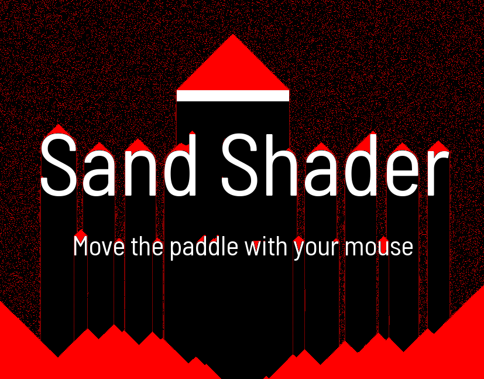
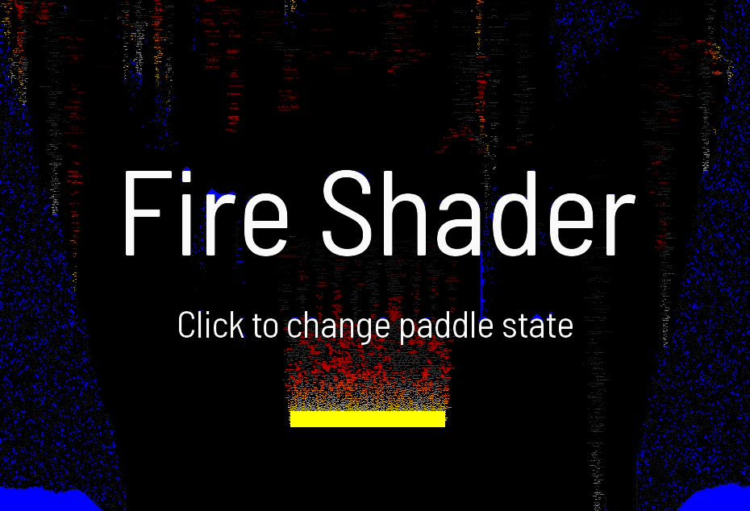

# Experiment Sand

> Chadnaut 2024  
> https://github.com/Chadnaut/Attract-Mode-Experiments

Something different with a surface shader feedback loop - falling sand art - with FIRE!

## Files

- `layout.nut` - The example layout
- `layout2.nut` - The example layout
- `sand.frag` - The example shader
- `sand2.frag` - The example shader
