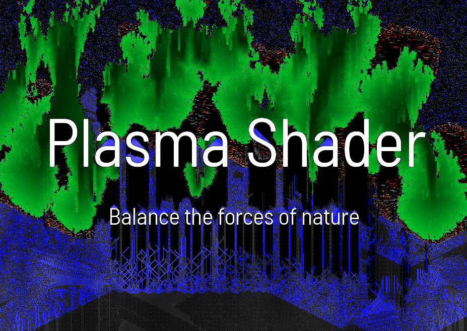

# Experiment Sand

> Chadnaut 2024  
> https://github.com/Chadnaut/Attract-Mode-Experiments

*IMPORTANT - Anti-Aliasing must be set to **None***\
The shader requires exact pixel values to run correctly!

Something different with a surface shader feedback loop - falling `sand art`. Catch it with the paddle!

Now with `fire` that sets the `sand` ablaze! Click the left mouse button to change the paddle state between `solid`, `sand` and `fire`.

A third state `plasma` helps bring balance to the force, be careful though - after some time it explodes into `sand` that feeds the `fire`.

## Files

- `layout.nut` - The example layout
- `layout2.nut` - The example layout
- `layout3.nut` - The example layout
- `sand.frag` - The example shader
- `sand2.frag` - The example shader
- `sand3.frag` - The example shader
